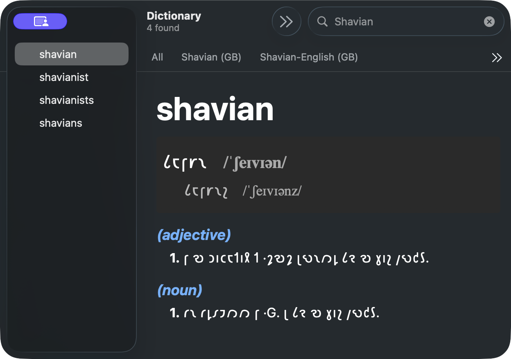

# Shaw-Spell



**Comprehensive Shavian spelling support for macOS**

Shaw-Spell provides dictionaries for Dictionary.app and system-wide spell checking for the Shavian alphabet. 
75,000+ Shavian words with definitions, pronunciations, and intelligent spell checking that works in all macOS apps.

**Download and learn more about the project at [joro.io/shaw-spell](https://joro.io/shaw-spell)**

## Building from Source

### Prerequisites

```bash
# Install Xcode Command Line Tools
xcode-select --install

# Install dependencies via Homebrew
brew install hunspell      # Spell checking library
brew install python@3      # For build scripts

# Install Python dependencies
pip3 install PyYAML

# Install shave tool (for Shavian transliteration)
# See: https://github.com/Shavian-info/shave
```

You'll also need the [Apple Dictionary Development Kit](https://github.com/SebastianSzturo/apple-dictionary-dev-kit) installed at `/Library/Developer/Dictionary Development Kit`.

### Build

```bash
git clone https://github.com/cozmic72/shaw-spell.git
cd shaw-spell
git submodule update --init --recursive
make install
```

This builds and installs the spell checker and the dictionaries under ~/Library.

### Regenerating Caches (Advanced)

The repository includes pre-built caches for faster builds. To regenerate them:

```bash
# Regenerate transliteration caches (requires shave tool)
make transliterations

# Regenerate comprehensive WordNet cache (~2 minutes)
make wordnet-cache
```

**Note:** The `shave` tool for Shavian transliteration is not currently publicly available but will be released soon. Until then, use the pre-built caches in `data/`.

## Copyright

Shaw-Spell © 2025 joro.io • [MIT License](LICENSE.md)

Includes:
- **[Readlex](https://github.com/shavian-info/readlex)** (Shavian word data) • MIT License
- **[Open English WordNet 2024](https://github.com/globalwordnet/english-wordnet)** (definitions) • CC BY 4.0

See [LICENSE.md](LICENSE.md) for complete details.
