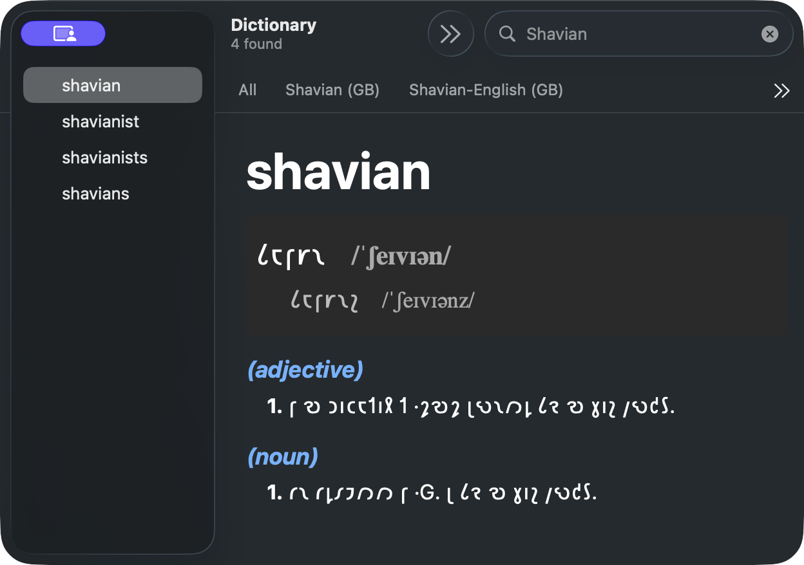

# Shaw-Spell



**Comprehensive Shavian spelling support for macOS**

Shaw-Spell provides dictionaries for Dictionary.app and system-wide spell checking for the Shavian alphabet. 
114,000+ Shavian dictionary entries with definitions, pronunciations, and intelligent spell checking that works in all macOS apps.

**Download and learn more about the project at [joro.io/shaw-spell](https://joro.io/shaw-spell)**

## Building from Source

### Prerequisites

```bash
# Install Xcode Command Line Tools
xcode-select --install

# Install dependencies via Homebrew
brew install hunspell      # Spell checking library (also needed by the web-UI daemon)
brew install python@3      # For build scripts

# Homebrew installs libhunspell as libhunspell-1.7.dylib. The `hunspell`
# (aka pyhunspell) Python binding used by the web-UI daemon links against an
# unversioned `-lhunspell`, so add an unversioned symlink so it builds.
# Production Linux hosts don't need this — `apt install libhunspell-dev`
# already ships libhunspell.so.
ln -sf "$(brew --prefix hunspell)/lib/libhunspell-1.7.dylib" \
       "$(brew --prefix hunspell)/lib/libhunspell.dylib"

# Install Python dependencies (PyYAML for the build system, hunspell/pyhunspell
# for the web-UI backing daemon — see src/site-daemon/README.md).
CPPFLAGS="-I$(brew --prefix hunspell)/include/hunspell" \
LDFLAGS="-L$(brew --prefix hunspell)/lib" \
pip3 install -r requirements.txt

# Install shave tool (for Shavian transliteration)
# See: https://github.com/Shavian-info/shave
```

You'll also need the [Apple Dictionary Development Kit](https://github.com/SebastianSzturo/apple-dictionary-dev-kit) installed at `/Library/Developer/Dictionary Development Kit`.

### Build

```bash
git clone https://github.com/cozmic72/shaw-spell.git
cd shaw-spell
make setup
make install
```

This builds and installs the spell checker and the dictionaries under ~/Library.

`make setup` initialises the git submodules. The `frequency-words` submodule
(hermitdave/FrequencyWords) ships every language at ~1.4 GB, but Shaw-Spell uses
only `content/2018/en/en_full.txt`. `make setup` checks it out with a
sparse-checkout so the tree stays ~30 MB instead of 1.4 GB; the other submodules
init normally. The target is re-runnable and safe to run on an existing tree.

## Supplement Data Pipeline

Shaw-Spell supplements the core ReadLex dictionary with pronunciation and definition data from several open-source datasources. See [`docs/pipeline-architecture.md`](docs/pipeline-architecture.md) for the full pipeline.

### Data Sources

| Source | What it provides |
|--------|-----------------|
| [ReadLex](https://github.com/shavian-info/readlex) | Core Shavian dictionary (IPA, Shavian, POS, frequency) |
| [Open English WordNet](https://github.com/globalwordnet/english-wordnet) | GB+US IPA, POS, definitions |
| [Wiktionary](https://kaikki.org/dictionary/English/) | IPA with dialect labels (RP, GenAm), definitions |
| Curated names / generated | Proper names (shave + CMUdict voters) and shave-generated no-IPA WordNet words |

(Britfone was dropped from the pipeline — marginal value, no POS, r-restoration quality issues. See [`docs/data-files.md`](docs/data-files.md).)

### Generating Supplements

The supplement build is a single in-memory orchestrator (`build_supplement.py`) that loads
the sources once and writes `data/supplement-combined-filtered.json`. The shipping
`data/readlex.json` is published by the EDITOR on Commit; the offline equivalent is the
single command `apply_patches.py`, which runs the corpus frequency pass over the
pre-patch record set (frequency is upstream processing), then applies the patch store
(the editorial last word), then writes the publish shape.

```bash
# Regenerate the supplement pool, re-score, apply editorial patches, build review files
make supplements-from-source

# Check the shipping readlex.json is present (a committed file the editor publishes)
make supplements

# Generate review files for human inspection
python3 src/tools/generate_review_files.py
```

### Make Targets

| Target | Description |
|--------|------------|
| `make supplements` | Ensure the committed readlex.json is present + not stale w.r.t. the patch store (runs `check-readlex`) |
| `make supplements-from-source` | Full rebuild from source data |
| `make rescore-full` | Re-score confidence with full shave consultation |
| `make review-files` | Generate review TSVs for human inspection |
| `make transliterations` | Rebuild Shavian definition caches (requires shave) |
| `make dictionaries` | Build all Apple Dictionary bundles |
| `make spellcheck` | Build all Hunspell dictionaries |
| `make site` | Build web dictionary frontend |

### Confidence Scoring

Each supplement entry carries a `confidence` in the range 0–100, computed by the final
build stage (`score_confidence_blend.py`) as a clamped weighted sum of voter signals
(positive weight = trust, negative = red flag). The per-voter contributions are persisted
on the record under `votes` so a score is explainable. It is an ordering the editor can
sort/filter on, not a fixed-tier ladder.

### Dialect Variants

The dialect model separates a record's **base accent** (scalar `var`) from the
**within-accent vowel mergers** its spelling reflects (an additive `mergers` list). See
[`docs/dialect-mergers.md`](docs/dialect-mergers.md) and [`docs/record-schema.md`](docs/record-schema.md).

| `var` | Meaning |
|-------|---------|
| `RRP` | Rhotic Received Pronunciation (canonical, universal default) |
| `RSSB` | Rhotic Standard Southern British (supplement data; collapses to RRP at export) |
| `GenAm` | General American (exceptions + supplement data) |
| `GenAus` `GenCan` `SthAfr` `NZ` `IrEng` | regional lanes harvested from Wiktionary accent tags (review pool; lanes with no upstream ReadLex counterpart are held back from readlex.json at export) |

Mergers are NOT `var` values — they live in `mergers`, e.g. `["trap-bath"]` (PALM 𐑭→TRAP 𐑨 in
BATH words). `cot-caught` and `lot-palm` are defined but currently disabled (see `MERGER_ENABLED`
in `src/tools/dialect_mergers.py`).

### Regenerating Caches

```bash
# Regenerate transliteration caches (requires shave tool)
make transliterations

# Regenerate comprehensive WordNet cache (~2 minutes)
make wordnet-cache

# Extract Wiktionary definitions for supplement words
python3 src/tools/extract_wiktionary_definitions.py
```

## Copyright

Shaw-Spell © 2025 joro.io • [MIT License](LICENSE.md)

Includes:
- **[ReadLex](https://github.com/shavian-info/readlex)** (Shavian word data) • MIT License
- **[Open English WordNet 2024](https://github.com/globalwordnet/english-wordnet)** (definitions) • CC BY 4.0
- **[Wiktionary](https://en.wiktionary.org/)** (pronunciations, definitions) • CC BY-SA 3.0

See [LICENSE.md](LICENSE.md) for complete details.
